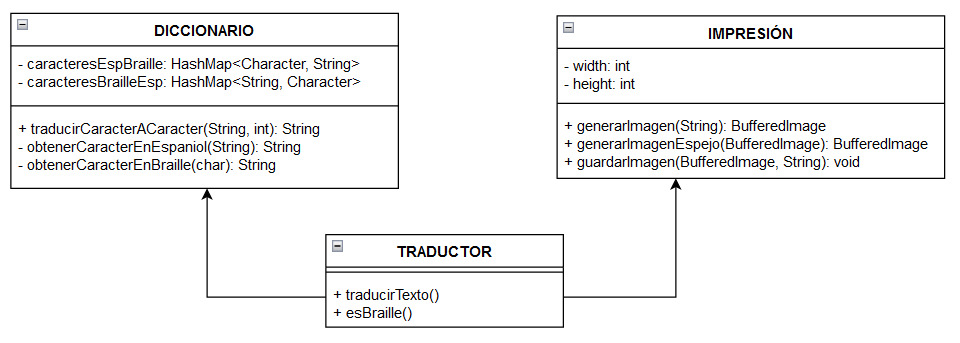

# Documentación del Ambiente de Desarrollo
#### 1. Descripción General

**Nombre del Proyecto:** Proyecto Entrega 1 - Bug Buster

**Descripción:** Este proyecto tiene como objetivo desarrollar una aplicación de traducción entre lenguaje español y Braille, ofreciendo una interfaz gráfica para ingresar texto en español y obtener su equivalente en Braille, así como también la posibilidad de traducir texto en Braille al español.

#### 2. Lenguaje de Programación

- **Lenguaje:** Java
- **Versión del JDK:** 21

#### 3. Entorno de Desarrollo Integrado (IDE)

- **IDE:** IntelliJ IDEA 2023.3.6 (Ultimate Edition)

#### 4. Control de Versiones

- **Sistema de Control de Versiones:** Git
- **Repositorio Remoto:** GitHub

#### 5. Sistema Operativo

- **Sistema Operativo:** Windows 11

#### 6. Instrucciones de Instalación y Configuración

##### 6.1 Instalación de Java

1. **Descargar e Instalar JDK 21:**
   - Visitar el [sitio web de Oracle](https://www.oracle.com/java/technologies/javase/jdk21-archive-downloads.html).
   - Descargar la versión correspondiente a tu sistema operativo.
   - Seguir las instrucciones de instalación.

2. **Configurar Variables de Entorno:**
   - Añadir `JAVA_HOME` a las variables de entorno apuntando al directorio de instalación del JDK.
   - Añadir `JAVA_HOME\bin` al `PATH`.

##### 6.2 Instalación de IntelliJ IDEA

1. **Descargar IntelliJ IDEA:**
   - Visitar el [sitio web de JetBrains](https://www.jetbrains.com/idea/download/).
   - Descargar la versión Ultimate Edition.

2. **Instalar IntelliJ IDEA:**
   - Seguir las instrucciones de instalación proporcionadas por JetBrains.

3. **Configurar el JDK en IntelliJ IDEA:**
   - Abrir IntelliJ IDEA.
   - Ir a `File > Project Structure > Project`.
   - Configurar el `Project SDK` a JDK 21.

##### 6.3 Configuración del Control de Versiones

1. **Instalar Git:**
   - Visitar el [sitio web de Git](https://git-scm.com/).
   - Descargar e instalar Git para Windows.

2. **Configurar Git en IntelliJ IDEA:**
   - Ir a `File > Settings > Version Control > Git`.
   - Configurar la ruta al ejecutable de Git.

3. **Clonar el Repositorio del Proyecto:**
   - Usar el comando `git clone` con la URL de tu repositorio en GitHub:
     ```bash
     git clone https://github.com/EriikJG/Proyecto_Entrega1_Bug_Buster.git
     ```

#### 7. Ejecución y Pruebas

##### 7.1 Ejecutar la Aplicación

1. **Abrir el Proyecto en IntelliJ IDEA:**
   - Ir a `File > Open` y seleccionar la carpeta del proyecto.

2. **Crear una Configuración de Ejecución:**
   - Ir a `Run > Edit Configurations`.
   - Añadir una nueva configuración de `Application`.
   - Configurar la clase principal (por ejemplo, `Main`).

3. **Ejecutar la Aplicación:**
   - Ir a `Run > Run 'Main'` o presionar `Shift + F10`.
##### 7.2 Diagrama de clases
El diagrama de clases puede ser representado con una herramienta como Draw.io, Lucidchart o cualquier otra herramienta de diagramación UML. A continuación se describe una estructura básica:




##### 7.3 Implementación del Código
A continuación se presenta un ejemplo de implementación del código fuente:

```java
package Traductor;  
  
import ProyectoGUI.MENU;  
  
public class ProyectoIA {  
  
    public static void main(String[] args) {  
        // MENU menu = new MENU();  
        // menu.setVisible(true);  
        Traductor t = new Traductor();  
  
        // Ejemplos de texto en Braille para traducir  
        String textoTraducido = t.traducirTexto("⠸⠷⠨⠁⠗⠃⠕⠇⠸⠾"); // (Árbol)  
        String textoTraducido1 = t.traducirTexto("⠸⠷⠨⠁⠗⠃⠾⠇⠸⠾"); // (Ából)  
        String textoTraducido2 = t.traducirTexto("⠸⠷⠷ ⠿ ⠽⠷⠾⠸⠾");  // (áéíúó)  
        // String textoTraducido3 = t.traducirTexto("⠸⠷⠨⠁⠗⠃⠾⠇⠾ ⠸⠪⠒⠨⠙⠸⠻");  
  
        // Imprime los resultados de las traducciones        System.out.println(textoTraducido);  
        System.out.println(textoTraducido1);  
        System.out.println(textoTraducido2);  
    }  
}
```

#### 8. Convenciones de Codificación

##### 8.1 Nombres de Clases

- Usar **CamelCase** para nombres de clases. 
- Ejemplo: `Translator`, `BrailleConverter`.

##### 8.2 Nombres de Métodos y Variables

- Usar **camelCase** para nombres de métodos y variables.
- Ejemplo: `translateText`, `brailleRepresentation`.

##### 8.3 Nombres de Constantes

- Usar **UPPER_CASE** para nombres de constantes.
- Ejemplo: `MAX_TRANSLATION_LENGTH`.

##### 8.4 Formato del Código

- **Indentación:** Usar 4 espacios por nivel de indentación.
- **Llaves:** Las llaves deben estar en la misma línea que la declaración.

##### 8.5 Comentarios

- Usar comentarios para explicar el propósito de las clases, métodos y cualquier lógica compleja.
- Ejemplo:

    ```java
    /**
     * Método para traducir texto en español a Braille.
     * @param texto Texto en español a traducir.
     * @return Texto en Braille.
     */
    public String translateToBraille(String texto) {
        // Lógica de traducción aquí
    }
    ```
---

Esta documentación proporciona instrucciones detalladas para configurar el ambiente de desarrollo, incluyendo la instalación de herramientas, configuración del entorno, y convenciones de codificación. Además, presenta un ejemplo de implementación del código fuente y sugiere herramientas para diagramación UML. Siguiendo estas instrucciones, los desarrolladores podrán colaborar eficientemente en el proyecto y mantener una estructura de código consistente.
