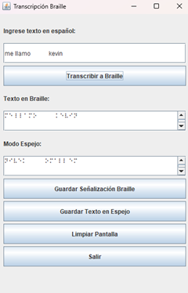

## Ejecución de casos de pruebas  
  
## Caso de prueba 1: Traducción de texto de español a Braille

  
  
  
## Caso de prueba 2 : Traducción de párrafos extensos

  

### Defecto encontrado :
*La traducción se realiza de manera correcta sin embargo la visualización de un párrafo demasiado grande es poco amigable.*
  
## Caso de prueba 3 : Traducción de Braille a español

### Defectos encontrados
*Se encontró un error o defecto al dibujar el carácter en braille en la GUI , al momento de intentar traducir un carácter en braille primero debe ser seleccionado el primer punto en caso contrario se muestra un mensaje indicando carácter no valido*
  

  
## Caso de prueba 4 : Traducción de textos con espacios en blanco

  

  
  
## Caso de prueba 5: Transcripción con vocales acentuadas  !

## Caso de prueba 6: Transcripción de números a Braille

  
## Caso de prueba 7: Transcripción de signos de puntuación 
  

  
**Defectos encontrados**  
Existen signos que aún no son traducidos.  
  
  
## Caso de prueba 8: traducción de una combinación de números y letras en una misma palabra  

## Caso de prueba 9: Generación de la señalética de español a braille

  
### Defecto encontrados
  
*No es posible guardar la imagen con un nombre especifico para luego realizar una mejor búsqueda de este.*

## Caso de prueba 11: Generación de la traducción en formato espejo  
  

  

### Defecto Encontrados

*Al igual que la generación de la señalización no es posible establecer un nombre.  
No es posible generar más de una vez la imagen con la traducción de español a braille en modo espejo*

## Caso de prueba 12: Traducción de textos o palabras con letras en mayúsculas y minúsculas combinadas

## Defecto encontrado  
  
*Al ingresar un texto con espacios extras entre las palabras se observo que estos espacios en la traducción también se ven reflejados.*
  
## Caso de prueba 13: Traducción de números de braille a español

  
