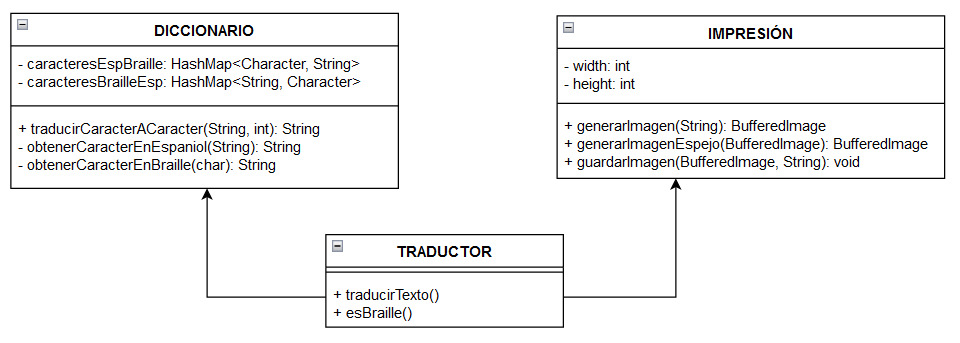

# ISWD652- CALIDAD DE SOFTWARE

## TEMA: Proyecto de Calidad de Software

## Historias de usuario

### Proyecto de Calidad de Software

1. **Transcribir textos de español a braille incluyendo números, abecedario, vocales acentuadas, y signos básicos.**

| **N°:** 1                   | **Título:** Traducción del abecedario y vocales acentuadas de español a Braille                                                                         |
| --------------------------- | ------------------------------------------------------------------------------------------------------------------------------------------------------- |
| **Historia de usuario:**    | **Como** usuario del sistema, **quiero** traducir el abecedario de español a Braille **para** poder entender los símbolos básicos del sistema braille.  |
| **Criterio de aceptación:** | **Dado** que se ingrese una letra del abecedario en minúsculo español **cuando** este se traduzca **entonces** mostrarse en Braille.                    |
|                             | **Dado** que se ingrese una letra del abecedario en Mayúscula español **cuando** este se traduzca **entonces** mostrarse su correspondiente en Braille. |

| **N°:** 2                   | **Título:** Traducción de los números del 0 al 9 a Braille                                                                     |
| --------------------------- | ------------------------------------------------------------------------------------------------------------------------------ |
| **Historia de usuario:**    | **Como** usuario, **quiero** poder traducir los números del 0 al 9 al Braille **para** entender las cantidades numéricas.      |
| **Criterio de aceptación:** | **Dado** que se ingrese un número del 0 al 9 **cuando** este se traduzca **entonces** mostrarse su correspondiente en Braille. |

| **N°:** 3                   | **Título:** Traducción signos básicos del español a Braille                                                                                          |
| --------------------------- | ---------------------------------------------------------------------------------------------------------------------------------------------------- |
| **Historia de usuario:**    | **Como** usuario, **quiero** poder traducir los signos básicos al Braille **para** poder entender las señales o marcas gráficas del sistema Braille. |
| **Criterio de aceptación:** | **Dado** que se ingrese signo básico **cuando** este se traduzca **entonces** mostrarse su correspondiente en Braille.                               |

2. **Transcribir textos de Braille a español.**

| **N°:** 4                   | **Título:** Traducción de caracteres de Braille a español                                                                                               |
| --------------------------- | ------------------------------------------------------------------------------------------------------------------------------------------------------- |
| **Historia de usuario:**    | **Como** usuario, **quiero** poder traducir los caracteres del Braille al español **para** entender los textos escritos en Braille.                     |
| **Criterio de aceptación:** | **Dado** que se ingrese un conjunto de caracteres Braille **cuando** estas se traduzcan **entonces** mostrará su correspondiente traducción en español. |

3. **Generar señalética braille a partir de textos en español. Ejemplo de impresión de señalética para ascensores (con aplicación Windows):**

| **N°:** 5                   | **Título:** Generar señalética en braille a partir de textos en español                                                                          |
| --------------------------- | ------------------------------------------------------------------------------------------------------------------------------------------------ |
| **Historia de usuario:**    | **Como** usuario, **quiero** imprimir traducciones de texto de español a braille **para** generar señaléticas en lugares que necesiten de estas. |
| **Criterio de aceptación:** | **Dado** que se ingrese un texto en español **cuando** estas se traduzcan **entonces** me generara un documento que puede ser impreso.           |

4. **Generar impresión en espejo de textos braille para escritura manual. La escritura braille es de derecha a izquierda, por ello se requiere imprimir en espejo la hoja guía. Para la escritura.**

| **N°:** 6                   | **Título:** Impresión de espejo de texto Braille                                                                         |
| --------------------------- | ------------------------------------------------------------------------------------------------------------------------ |
| **Historia de usuario:**    | **Como** usuario, **quiero** imprimir el texto en braille **para** facilitar la escritura manual.                        |
| **Criterio de aceptación:** | **Dado** que se desea imprimir un texto **cuando** se imprima en Braille **entonces** deberá imprimirse en forma espejo. |

## DIAGRAMA DE CLASES

