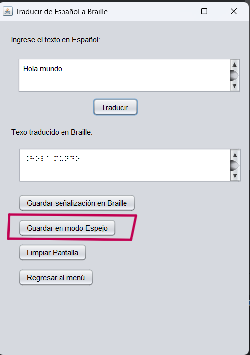

### Manual de Usuario: Traductor de Braille a Español y Español a Braille- Proyecto Entrega 1 - Bug Buster
### Manual de Usuario - Traductor de Braille

Este manual te guiará a través del uso del Traductor de Braille, una herramienta que te permitirá transcribir textos entre español y Braille, así como generar señalética Braille y imprimir textos en espejo para escritura manual. Sigue los pasos a continuación para comenzar a utilizar el software.

#### 1. Interfaz de Usuario

La interfaz del Traductor de Braille está diseñada de manera sencilla e intuitiva. Al abrir la aplicación, encontrarás las siguientes secciones:

- **Transcripción de Texto:** Aquí puedes introducir el texto que deseas traducir a Braille o viceversa.
- **Opciones de Traducción:** Permite seleccionar la dirección de traducción (español a Braille o Braille a español) y otras opciones adicionales.
- **Visualización de Resultados:** Muestra el resultado de la traducción en tiempo real.
- **Señalética y Espejo:** Opciones para generar señalética Braille y textos en espejo para escritura manual.

#### 2. Interfaz de Usuario

La interfaz de usuario de la aplicación consta de dos secciones principales: la traducción de Braille a Español y la traducción de Español a Braille.

#### 4. Traducción de Español a Braille

En la sección de traducción de Español a Braille, puedes ingresar texto en Español y obtener su traducción al código Braille. Sigue estos pasos para utilizar esta función:

1. Ingresa el texto en Español en el campo de entrada provisto.
2. Haz clic en el botón "Traducir".
3. La traducción al código Braille del texto en Español aparecerá en el área de salida.
#### 3. Traducción de Braille a Español

En la sección de traducción de Braille a Español, puedes ingresar texto en código Braille y obtener su traducción al Español. Sigue estos pasos para utilizar esta función:

1. Ingresa el texto en código Braille en el campo de entrada provisto.
2. Haz clic en el botón "Traducir".
3. La traducción al Español del texto en código Braille aparecerá en el área de salida.
#### 5. Generación de Señalética

Si deseas generar señalética Braille a partir de un texto en español, sigue estos pasos:

1. Ingresa el texto deseado en el área de transcripción.
2. Haz clic en el botón "Traducir".
3. Haz clic en el botón correspondiente para iniciar la generación de la señalética.

#### 6. Impresión en Espejo

Para imprimir textos en espejo para escritura manual, sigue estos pasos:

1. Traduce el texto deseado a Braille.
2. Selecciona la opción de imprimir en espejo.
4. Imprime el resultado y utilízalo como guía para la escritura manual en Braille
#### 7. Ejemplos de Uso

- **Traducción de Español a Braille**: Ingresa el texto "Casa" en Español y haz clic en "Traducir a Braille". Deberías obtener la traducción en código Braille correspondiente a "Casa".

- **Traducción de Braille a Español**: Ingresa el código Braille correspondiente al texto "Hola Mundo" y haz clic en "Traducir". Deberías obtener la traducción "Hola Mundo" en Español.
#### 8. Notas

- La traducción de Braille a Español y Español a Braille se realiza utilizando un algoritmo de conversión implementado en el sistema.
- La precisión de la traducción puede variar dependiendo de la complejidad del texto y la calidad del código Braille ingresado.

#### 9. Problemas Comunes y Soluciones

- **Traducción Incorrecta**: Si la traducción no es precisa, verifica que el texto ingresado esté en el formato correcto y que no haya errores tipográficos.

#### 10. Información de Contacto

Para obtener más información sobre el Traductor de Braille a Español y Español a Braille, o para informar sobre problemas o sugerencias, comunícate con el equipo de desarrollo en [bugBuster@gmail.com](mailto:contacto@traductorbraille.com).

---

Este manual proporciona una guía detallada para utilizar el Traductor de Braille a Español y Español a Braille de manera efectiva. Si necesitas más ayuda o tienes alguna pregunta, no dudes en ponerte en contacto con el equipo de desarrollo.
