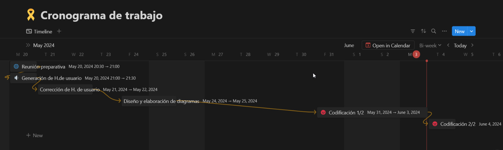

# Planificación de Actividades
## Objetivos
- Definir los objetivos específicos del proyecto.
- Identificar los recursos necesarios.
- Establecer un cronograma detallado.

## Semana 1 y 2
## Cronograma

*Enlace cronograma*: https://tasteful-cycle-2dc.notion.site/ea7b5bdacd754e6ea18c9b41f8bfc91d?v=882cb3aa4c214ceb9071cd220ba41921*

## Actividades
Claro, aquí tienes una descripción más detallada para cada actividad:

### 1. Reunión de Inicio y Análisis de Requisitos
**Fecha:** 20/05/2024  
**Duración:** 1 hora  
**Participantes:** Equipo del proyecto

**Descripción:**
- Presentación detallada del proyecto, incluyendo su alcance, objetivos y beneficios esperados.
- Recolección exhaustiva de los requisitos del cliente, asegurando una comprensión completa de las necesidades.
- Discusión y definición de las historias de usuario, estableciendo los principales flujos de trabajo del sistema.
- Creación del repositorio del proyecto en la plataforma elegida (por ejemplo, GitHub, Bitbucket), configurando las ramas principales y estableciendo un flujo de trabajo básico.

### 2. Corrección de Historias de Usuario
**Fecha:** 21/05/2024  
**Duración:** 1 hora  
**Participantes:** Equipo del proyecto

**Descripción:**
- Revisión minuciosa de las historias de usuario identificadas previamente.
- Identificación y corrección de posibles ambigüedades, inconsistencias o requisitos faltantes en las historias.
- Aseguramiento de que las historias de usuario sean claras, específicas, alcanzables y relevantes para los objetivos del proyecto.

### 3. Diseño y Elaboración de Diagramas de Clases
**Fecha:** 24/05/2024 - 25/05/2024  
**Duración:** 2 días  
**Participantes:** Equipo del proyecto

**Descripción:**
- Creación de diagramas de clases utilizando herramientas de modelado (por ejemplo, UML) para representar la estructura estática del sistema.
- Identificación de las clases principales, sus atributos y relaciones, así como los métodos asociados.
- Elaboración de diagramas adicionales según sea necesario, como diagramas de paquetes o diagramas de despliegue, para abordar aspectos específicos del diseño.

### 4. Codificación de la Versión 1.0
**Fecha:** 31/05/2024 - 03/06/2024  
**Duración:** 4 días  
**Participantes:** Equipo del proyecto

**Descripción:**
- Implementación del código base del proyecto, siguiendo las especificaciones definidas en las historias de usuario y los diagramas de clases.
- Desarrollo de casos de prueba unitarios para validar el comportamiento esperado de las diferentes partes del sistema.
- Integración continua del código en el repositorio principal, asegurando una colaboración fluida entre los miembros del equipo y una visibilidad actualizada del progreso del proyecto.

### 5. Refinamiento y Corrección de Bugs
**Fecha:** 04/06/2024 - 05/06/2024  
**Duración:** 2 días  
**Participantes:** Equipo del proyecto

**Descripción:**
- Optimización del código existente para mejorar su rendimiento, legibilidad y mantenibilidad.
- Identificación y corrección de errores y fallos (bugs) reportados durante las pruebas realizadas en la etapa de codificación.
- Ejecución de pruebas adicionales para garantizar la estabilidad y calidad del sistema antes de su entrega o despliegue.
## Observaciones
- Las fechas pueden ajustarse según la disponibilidad de los participantes.
- Se deben programar reuniones de seguimiento semanales.

